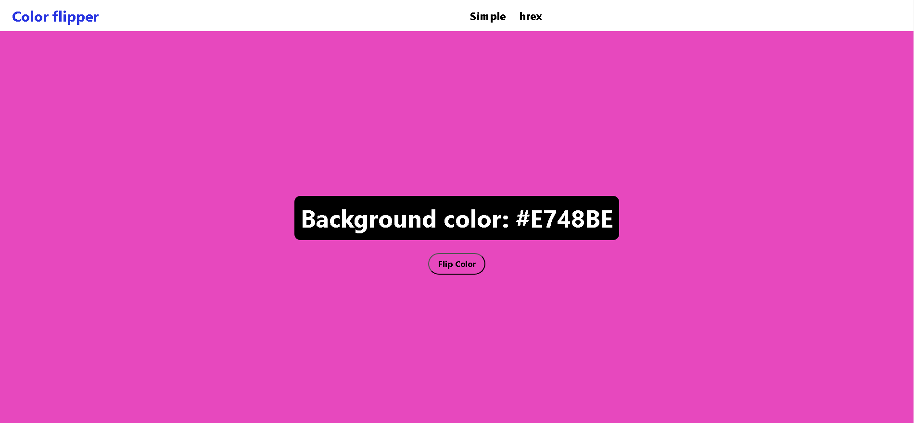

# Random Color Flipper



Random Color Flipper is a simple JavaScript project that generates random colors and displays them on the screen. It's a fun and creative way to explore colors and can be used for various purposes like inspiration, design, or just for fun.

## Features

- Generates random colors with every click.
- Displays the hex color code of the generated color.
- Background color of the page changes to the generated color.
- User-friendly and easy to use.

## Clone this repository to your local machine:
   ```shell
   git clone https://github.com/Joao-Pereira013/JS-ColorFlipper.git
   ```
